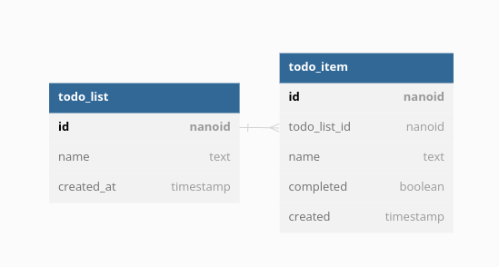

# Snap eHealth assignment

I chose to do two out of the three options listed in the [assignment pdf](./resources/assets/swe-coding-challenge-202305.pdf); the todo list and the shopping cart implementation both within the same http server.

## Installation

This project uses the [Clojure CLI](https://clojure.org/guides/deps_and_cli) as the package manager as well as [docker](https://www.docker.com/) to run a local database.

## Stack

- database
  - [postgres](https://www.postgresql.org/) - SQL database
  - [next.jdbc](https://github.com/seancorfield/next-jdbc) - clojure database access
  - [honey sql](https://github.com/seancorfield/honeysql) - write database queries as clojure maps
  - [hikari-cp](https://github.com/tomekw/hikari-cp) - jdbc connection pool
  - [migratus](https://github.com/yogthos/migratus) - database migration library
- routing
  - [reitit](https://github.com/metosin/reitit) - data driven routing library
  - [swagger](https://swagger.io/) - api documentation
  - [malli](https://github.com/metosin/malli) - schema definitions and coercion
- utility
  - [integrant](https://github.com/weavejester/integrant) - clojure state management
  - [timbre](https://github.com/ptaoussanis/timbre) - logging
  - [nanoid](https://github.com/ai/nanoid) - URL-friendly unique string ID generator

## Data Model

### Todo lists



### Shopping Cart


## Routes

- `/api/`
  - `/health-check` - check to see if server is alive
  - `/todo-list`
    - basic CRxD implementation
    - get-all route has virtual columns `:todo-items` and `:todo-items-complete` to show the number of items in each todo list
    - get route has virtual column `:todo-list/todo-items` that has a list of all todo items for the corresponding list
    - `POST` to `/todo-list/:id` creates a todo item related to the current todo list
  - `/todo-item` - basic xRUD implementation
  - `/product`
    - basic CRUD implementation
    - get route has a query parameter to show/hide items with 0 quantity
  - `/cart`
    - basic CRxD implementation
    - `PUT` to `/cart/:id` checks out cart and updates product quantities accordingly
    - `POST` to `/cart/:id` adds product to cart
    - `DELETE` to `/cart/:id/:product-id` removes product from cart
    - adding to cart and checkout throws http `409` Conflict exceptions if invalid quantities

## Usage

First download and run the postgres instance using `docker compose` inside of the working directory.

```bash
$ docker compose up -d
$ docker ps -a
CONTAINER ID   IMAGE                        COMMAND                  CREATED        STATUS                      PORTS                                       NAMES
3e0fb42d3001   postgres                     "docker-entrypoint.s…"   20 hours ago   Up 33 minutes
```

Now you can run the main function using the `:run` alias and access the http server on port 8080.

```bash
$ clj -M:run

```

To run the interactive terminal use the `:dev` alias and evaluate the `start-interactive` function.

```bash
$ clj -M:dev
Clojure 1.11.1
user=> (start-interactive)
```

To run all test cases use the `:test` alias.

```bash
$ clj -M:test
```

For migrations, we are using a custom subset of [migratus](https://github.com/yogthos/migratus#quickstart-with-native-clojure-projects) through the CLI and migrations are run on startup to keep databases synchronized.
